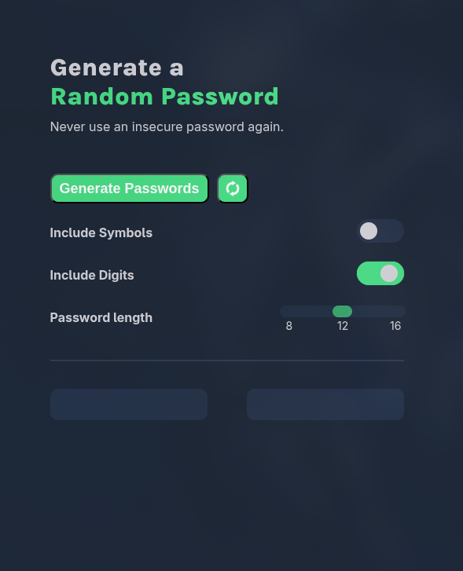

# Password Generator

A simple random password generator built with HTML, CSS, and JavaScript.

## Features

- Generate two random passwords
- Include symbols
- Include digits
- Choose password length: 8, 12, or 16 characters
- Copy generated passwords to the clipboard
- Reset and generate new passwords

## Built With

- HTML
- CSS
- JavaScript

## How to Use

1. Open `index.html` in a browser.
2. Choose your password options.
3. Select a password length.
4. Click **Generate Passwords**.
5. Click a generated password to copy it.

## Note

This project was built as a JavaScript practice project while learning the fundamentals of JavaScript.