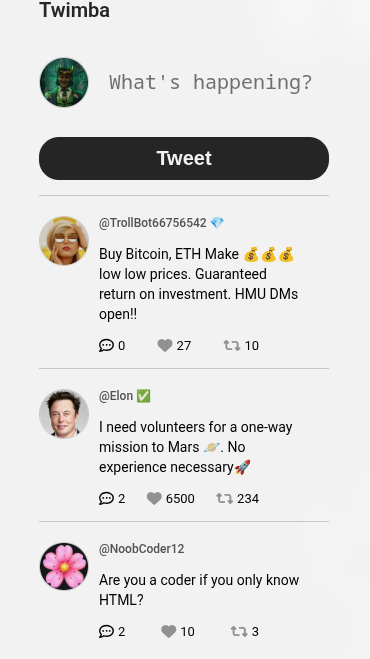

# Twimba

A small Twitter-style feed built with HTML, CSS and JavaScript.

## Screenshot

## Features

- Create new tweets
- Like and retweet tweets
- Show and hide replies
- Render tweets from JavaScript data

## What I Practiced

- DOM manipulation
- Event delegation
- JavaScript modules
- Working with objects and arrays
- Rendering dynamic HTML
