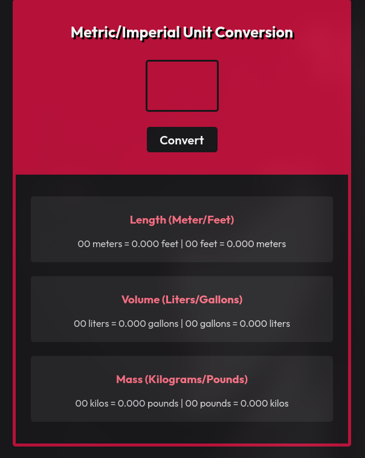

# Unit Converter

A simple metric/imperial unit converter built with HTML, CSS, and JavaScript.

## Screenshot

## Features

- Convert length between meters and feet
- Convert volume between liters and gallons
- Convert mass between kilograms and pounds
- Simple and responsive user interface
- Input validation for values from 0 to 99

## Built With

- HTML5
- CSS3
- JavaScript

## What I Practiced

- DOM manipulation
- Event listeners
- JavaScript functions
- Number input handling
- Basic unit conversion calculations

## Author

Hamza — [GitHub](https://github.com/Code-by-Hamza)
